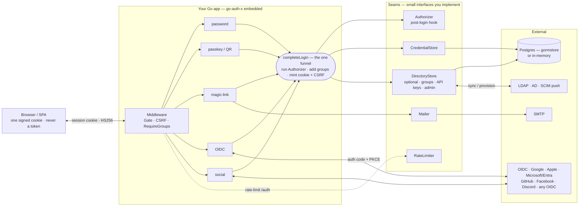

# go-auth-x

**Go Authentication, eXtended** — a self-contained, batteries-included authentication library for
Go web apps. Embed multi-method auth directly in your service with **no separate identity provider
to run**: one signed, HttpOnly session cookie; the browser never sees a token.

[](https://pkg.go.dev/github.com/alex-savin/go-auth-x)
[](https://goreportcard.com/report/github.com/alex-savin/go-auth-x)
[](https://github.com/alex-savin/go-auth-x/releases)
[](https://go.dev/)
[](./LICENSE)

```go
import authx "github.com/alex-savin/go-auth-x"
```

> Extracted from a production trading platform's backend-for-frontend (BFF). Passwords, passkeys
> (incl. **cross-device QR**), email magic-links, OIDC, social login, and **2FA** (TOTP + passkey +
> step-up) — all behind a single `completeLogin` funnel, plus an optional enterprise directory layer
> (groups, API keys, LDAP, SCIM).

---

## Table of contents

- [Why go-auth-x](#why-go-auth-x)
- [Feature overview](#feature-overview)
- [Install](#install)
- [Quick start](#quick-start)
- [Architecture](#architecture)
- [Configuration](#configuration)
- [Authentication methods](#authentication-methods)
- [HTTP endpoints](#http-endpoints)
- [Directory layer: groups, access control, API keys, LDAP & SCIM](#directory-layer)
- [Storage: reference stores & writing your own](#storage)
- [Security model](#security-model)
- [Framework support](#framework-support)
- [Testing](#testing)
- [Project layout](#project-layout)
- [Roadmap](#roadmap)
- [Contributing](#contributing)
- [License](#license)

---

## Why go-auth-x

Most Go auth options force a choice between two extremes:

1. **Run a separate identity provider** (Keycloak, ORY, Auth0). Powerful, but now you
   operate another service, your passkeys live on a different origin, and simple apps inherit a lot
   of moving parts.
2. **Hand-roll it.** A session cookie here, a bcrypt call there, a WebAuthn ceremony you hope you
   got right — and the account-linking edge cases that cause real takeovers.

go-auth-x is the **middle path: a library you embed**. It runs in your process, authenticates users
**directly** with whatever methods you enable, and hands your app one signed session cookie. Because
it's same-origin, **passkeys (including the phone-scanned QR / cross-device flow) just work** — no
IdP hand-off, no "double login page."

**Use go-auth-x when** you want full-featured auth *inside one Go app* without operating an IdP.
**Use a dedicated IdP when** you need centralized SSO across many separate services.

---

## Feature overview

**Authentication methods**
- 🔑 **Passwords** — bcrypt (cost 12), NIST-style policy, constant-time anti-enumeration.
- 🟢 **Passkeys / WebAuthn** — discoverable (usernameless) login, **cross-device QR** (FIDO2 hybrid),
  clone detection, self-service enrollment & removal.
- ✉️ **Email magic-links** — passwordless sign-in + email verification + password reset, all via
  single-use, hashed-at-rest tokens.
- 🌐 **OIDC client** — Authorization Code + PKCE; consume any OIDC provider (Keycloak, Auth0, …).
- 👥 **Social login** — Google, Apple & Microsoft/Entra (OIDC), GitHub, Facebook & Discord (REST/Graph),
  plus **any OIDC provider** via `Config.SocialOIDC`; verified-email only.
- 🔐 **Two-factor (2FA)** — TOTP authenticator apps + single-use recovery codes; **stdlib, no dependency**.

**Session & transport**
- 🍪 **BFF sessions** — one HMAC-signed (HS256) HttpOnly cookie; the SPA never handles tokens.
- 🛡 **CSRF** — double-submit token, enforced on state-changing requests.
- 🧩 **Framework-agnostic** — mount as an `http.Handler`; net/http middleware for chi/echo/stdlib.

**Directory (optional, enterprise tier)**
- 🗂 **Groups** + per-group **access control** middleware.
- 🔐 **API keys** (Bearer) + an **admin REST API**.
- 🏢 **LDAP** sync and a minimal **SCIM 2.0** provisioning server.

**Operational**
- 🚦 Rate limiting + soft lockout, trusted-proxy-aware client IP.
- 🧪 Reference **GORM** and **in-memory** stores; swap in your own via small interfaces.

---

## Install

```bash
go get github.com/alex-savin/go-auth-x
```

Requires **Go 1.26+**. Sub-packages:

| Import | Purpose |
|---|---|
| `github.com/alex-savin/go-auth-x` | The auth engine (`authx`) |
| `github.com/alex-savin/go-auth-x/store/gormstore` | Reference GORM `CredentialStore` + `DirectoryStore` |
| `github.com/alex-savin/go-auth-x/store/memory` | Zero-dependency in-memory store (tests/demos) |
| `github.com/alex-savin/go-auth-x/mailer` | SMTP (STARTTLS) `Mailer` |
| `github.com/alex-savin/go-auth-x/ldapsync` | LDAP/AD → directory sync |
| `github.com/alex-savin/go-auth-x/scim` | SCIM 2.0 provisioning server |

---

## Quick start

The library is **pure `net/http`** — no framework dependency. Mount `Handler()` in any mux (net/http,
chi, echo, …) and gate your own routes with the provided middleware.

```go
package main

import (
	"context"
	"log"
	"net/http"

	"gorm.io/driver/postgres"
	"gorm.io/gorm"

	authx "github.com/alex-savin/go-auth-x"
	"github.com/alex-savin/go-auth-x/mailer"
	"github.com/alex-savin/go-auth-x/scim"
	"github.com/alex-savin/go-auth-x/store/gormstore"
)

func main() {
	db, _ := gorm.Open(postgres.Open(dsn), &gorm.Config{})
	store, _ := gormstore.New(db) // migrates the authx_* tables

	cfg := authx.ConfigFromEnv() // SESSION_SECRET (>=32B), APP_URL, OWNER_EMAIL, OIDC_*, GOOGLE_*, ...
	authn, err := authx.New(context.Background(), cfg)
	if err != nil {
		log.Fatal(err)
	}
	authn.SetCredentialStore(store)         // persistence
	authn.SetDirectoryStore(store)          // optional: groups / API keys / admin API
	authn.SetTwoFactorStore(store)          // optional: TOTP 2FA + recovery codes
	authn.SetMailer(mailer.FromEnv())       // optional: enables magic-link / verify / reset
	authn.SetAuthorizer(store.Authorizer()) // safe identity upsert (wrap to add provisioning)
	authn.SetLocalEnabled(true)             // turn on password + passkey + email

	mux := http.NewServeMux()
	mux.Handle("/auth/", authn.Handler()) // /auth/* (JSON + ceremony endpoints; you own the UI)
	mux.Handle("/scim/v2/", http.StripPrefix("/scim/v2", // optional SCIM provisioning
		scim.NewServer(store, func(t string) bool { return authn.ValidateAPIKeyScope(t, "scim") }).Handler()))

	// your app, gated by session + CSRF; restrict sensitive routes by group:
	app := http.NewServeMux()
	app.Handle("/admin", authn.RequireGroupsHTTP("admins")(http.HandlerFunc(adminHandler)))
	mux.Handle("/", authn.GateHTTP(authn.CSRFHTTP(app)))

	log.Fatal(http.ListenAndServe(":8080", mux))
}

// inside any gated handler:
//   sub, email, ok := authx.SessionFromRequest(r)
//   groups := authx.GroupsFromRequest(r)
```

> **You provide the login UI.** The library serves JSON + the WebAuthn/OIDC ceremony endpoints under
> `/auth/*`; your app renders the login/register pages and calls them (see [HTTP endpoints](#http-endpoints)).

---

## Architecture

go-auth-x is a **backend-for-frontend**. The single-page app talks only to your backend; the backend
holds all secrets and issues one signed cookie.



**The funnel.** Password, passkey, magic-link, OIDC, and social logins all end in **one**
`completeLogin` — which runs the `Authorizer`, enriches the session with the user's groups, mints the
cookie, and issues a CSRF token. No method can mint a session that skips your provisioning or the
disabled/verified gates.

**The seams** (all small interfaces, so you control storage and policy):

| Interface | Responsibility | Reference impl |
|---|---|---|
| `CredentialStore` | persist users, passwords, passkeys, tokens, OAuth identities | `gormstore`, `memory` |
| `Authorizer` | post-login hook: identity upsert (+ your provisioning) | `store.Authorizer()` |
| `Mailer` | send auth emails | `mailer` (SMTP) |
| `DirectoryStore` *(optional)* | groups, membership, API keys, admin user mgmt | `gormstore`, `memory` |

---

## Configuration

`authx.ConfigFromEnv()` reads the environment; or build `authx.Config{}` yourself. Local methods are
turned on with `SetLocalEnabled(true)`; email methods activate when a `Mailer` is set; each social
provider activates when its client id + secret are present.

| Env var | Config field | Notes |
|---|---|---|
| `SESSION_SECRET` | `SessionSecret` | **Required, ≥ 32 bytes.** HMAC key for the session/flow/CSRF cookies. |
| `APP_URL` | `AppURL` | Public origin, e.g. `https://app.example.com`. Used for email links + redirects. |
| `OWNER_EMAIL` | `OwnerEmail` | Exempt from hard lockout; gates the admin API via session. |
| `COOKIE_SECURE` | `CookieSecure` | Force the `Secure` flag (also auto-on under TLS / `X-Forwarded-Proto: https`). |
| `OIDC_ISSUER` | `Issuer` | Enables the OIDC client (with `OIDC_CLIENT_ID`). |
| `OIDC_CLIENT_ID` / `OIDC_CLIENT_SECRET` | `ClientID` / `ClientSecret` | Confidential OIDC client. |
| `OIDC_REDIRECT_URL` | `RedirectURL` | e.g. `https://app.example.com/auth/callback`. |
| `OIDC_ALLOWED_GROUPS` | `AllowedGroups` | Comma-sep allow-list; empty = any authenticated user. |
| `OIDC_ASSUME_VERIFIED` | `OIDCAssumeVerified` | Trust the issuer's email when the id_token omits `email_verified` (single trusted IdP only). Default off → require the claim. |
| `GOOGLE_CLIENT_ID` / `GOOGLE_CLIENT_SECRET` | `GoogleClientID` / `…Secret` | Enables Google login. |
| `GITHUB_CLIENT_ID` / `GITHUB_CLIENT_SECRET` | `GitHubClientID` / `…Secret` | Enables GitHub login. |
| `FACEBOOK_CLIENT_ID` / `FACEBOOK_CLIENT_SECRET` | `FacebookClientID` / `…Secret` | Enables Facebook login. |
| `APPLE_CLIENT_ID` `APPLE_TEAM_ID` `APPLE_KEY_ID` `APPLE_PRIVATE_KEY` | `AppleClientID` / `…TeamID` / `…KeyID` / `…PrivateKey` | Sign in with Apple (Services ID, Team ID, Key ID, `.p8` PEM). Requires HTTPS. |
| `MICROSOFT_CLIENT_ID` / `MICROSOFT_CLIENT_SECRET` / `MICROSOFT_TENANT` | `MicrosoftClientID` / `…Secret` / `…Tenant` | Microsoft / Entra ID login. Tenant defaults to `common`; set a directory ID to restrict to one org. |
| `DISCORD_CLIENT_ID` / `DISCORD_CLIENT_SECRET` | `DiscordClientID` / `…Secret` | Enables Discord login (verified email required). |
| — (programmatic) | `SocialOIDC []SocialOIDCProvider` | Register any OIDC IdP (GitLab, Okta, Auth0, Keycloak, …) as a social login. |
| `TRUSTED_PROXIES` | — (`authx.TrustedProxies()`) | CSV of proxy CIDRs; default = private ranges + loopback. |
| `WEBAUTHN_RPID` / `WEBAUTHN_RP_NAME` | — | Override the passkey relying-party id/name (default: app host). |
| `SMTP_HOST` `SMTP_PORT` `SMTP_USER` `SMTP_PASS` `SMTP_FROM` | — (`mailer.FromEnv()`) | STARTTLS sender. |

Boot **fails closed** if auth is active and `SESSION_SECRET` is shorter than 32 bytes.

---

## Authentication methods

### Passwords
`POST /auth/password/signup` → creates an unverified user and emails a verification link.
`POST /auth/password/login` → verifies bcrypt, requires a verified email, mints the session. NIST-style
policy (length + breach/email-localpart checks), constant-cost dummy-hash on unknown users to defeat
enumeration, and a transparent rehash path via a stored algorithm tag.

### Passkeys / WebAuthn (incl. cross-device QR)
Same-origin WebAuthn — no IdP hop. **Registration requires a discoverable (resident) credential and
does not pin `authenticatorAttachment`**, so an enrolled passkey works passwordless *and* cross-device.
**Login is discoverable (usernameless)**, which is exactly what makes the browser offer "use a phone
or tablet" → a **QR code** (FIDO2 hybrid transport). Sign-count **clone detection** rejects copied
authenticators. Challenges live in a short-lived signed cookie; the relying-party id is fixed config.

### Email magic-links
`POST /auth/email/request` emails a one-time sign-in link; `GET /auth/email/login` redeems it (and marks
the email verified). Same machinery powers email verification and password reset. All tokens are 256-bit,
**sha256-at-rest**, **single-use** (atomic redemption), per-purpose TTL, with always-200 anti-enumeration.

### OIDC
`GET /auth/login` runs Authorization Code + **PKCE (S256)** with `state` + `nonce`; `GET /auth/callback`
verifies the id_token, enforces `OIDC_ALLOWED_GROUPS`, and funnels into `completeLogin`. `state`/`nonce`
are compared in constant time (OAuth 2.0 Security BCP / RFC 9700).

### Social (Google, GitHub, Facebook, Apple, Microsoft, Discord + any OIDC)
`GET /auth/social/{provider}/login`. **Google**, **Apple** & **Microsoft/Entra** use OIDC
(verified-email id_token + nonce + `azp`); **GitHub** uses REST (`/user` + `/user/emails`,
primary+verified); **Facebook** uses the Graph API (`/me`, with an `appsecret_proof`); **Discord**
uses REST (`/users/@me`, verified email). Identities key on **(provider, subject)**; a new identity
links to a **verified-email** user, **reclaims** an unverified squatter, or creates one (see
[account-linking invariant](#account-linking-invariant)).

**Any OIDC provider** — register one programmatically and it mounts at `/auth/social/<name>/…`:

```go
cfg.SocialOIDC = []authx.SocialOIDCProvider{{
    Name: "gitlab", Issuer: "https://gitlab.com",
    ClientID: id, ClientSecret: secret, // Scopes default to openid, email, profile
}}
```

This covers GitLab, Okta, Auth0, Keycloak, and the like with the same PKCE + nonce + `azp` +
`email_verified` path as Google. Set `AssumeVerified` per provider (or `MICROSOFT_STRICT_EMAIL_VERIFIED`
for Microsoft) to control whether a token that omits `email_verified` is trusted. `GET /auth/config`
lists every enabled provider in `socialProviders` so the SPA can render the right buttons.

**Sign in with Apple** needs four env values (`APPLE_CLIENT_ID` = Services ID, `APPLE_TEAM_ID`,
`APPLE_KEY_ID`, `APPLE_PRIVATE_KEY` = the `.p8` PEM) — the library signs Apple's ES256 client-secret JWT
for you and regenerates it per exchange. Because Apple returns its callback via **`form_post`** (a
cross-site POST), the login flow cookie is set `SameSite=None`, so **Apple requires HTTPS** and the name
is delivered only on the user's first authorization.

### Two-factor (TOTP + recovery codes)
Wire the optional `TwoFactorStore` with `SetTwoFactorStore(store)` (reference impls in `gormstore` +
`memory`). TOTP is implemented with the **standard library only — no dependency** (RFC 4226/6238,
HMAC-SHA1 / 6 digits / 30s, ±1-step skew), verified against the published RFC vectors.

- **Enroll** — `POST /auth/2fa/totp/begin` (session-gated) returns the `otpauth://` URI + base32 secret
  (**you render the QR** — the library ships no image dependency); `POST /auth/2fa/totp/confirm`
  validates a code, enables it, and returns single-use **recovery codes** once.
- **Enforce** — when a user has TOTP enabled, a first-factor login no longer mints the session: it sets
  a short-lived signed **`2fa_pending`** cookie and the response signals a second factor is needed
  (`{ "twoFactorRequired": true }` for the JSON methods; a redirect with `?mfa=required` for
  social/magic-link — poll `GET /auth/2fa/pending`). `POST /auth/2fa/verify` with a TOTP **or** a
  recovery code finishes the login.
- **Security** — codes are constant-time compared; a used time-step is remembered to reject **replay**;
  recovery codes are **sha256-at-rest + single-use**; `POST /auth/2fa/disable` requires a current code;
  `/auth/2fa/verify` is rate-limited.
- **Passkey as a second factor** — a 2FA-halted login can instead complete the second step with a
  registered passkey (`POST /auth/2fa/webauthn/begin` + `/finish`).
- **Step-up / re-auth** — wrap sensitive routes with `authn.RequireStepUpHTTP(maxAge)`; a stale/absent
  step-up returns `403 {"error":"reauth_required"}`, and `POST /auth/reauth` (password **or** a 2FA
  code) sets a short-lived step-up cookie so the action can proceed.

---

## HTTP endpoints

Mounted under `/auth` by `Handler()`:

| Method | Path | Purpose | Auth |
|---|---|---|---|
| GET | `/auth/login` · `/auth/callback` | OIDC start / callback | public |
| GET | `/auth/logout` · `/auth/me` · `/auth/config` | logout / session info / enabled methods | public |
| POST | `/auth/password/signup` · `/auth/password/login` | password signup / login | public |
| POST | `/auth/password/reset/request` · `/auth/password/reset/confirm` | password reset | public |
| POST | `/auth/email/request` | request a magic-link | public |
| GET | `/auth/email/login` · `/auth/email/verify` | redeem magic-link / verify email | token |
| POST | `/auth/webauthn/login/begin` · `/auth/webauthn/login/finish` | passkey sign-in (discoverable / QR) | public |
| POST | `/auth/webauthn/register/begin` · `/auth/webauthn/register/finish` | enroll a passkey | session |
| GET / POST | `/auth/social/{provider}/login` · `/auth/social/{provider}/callback` | Google / GitHub / Facebook / Apple / Microsoft / Discord / any OIDC | public |
| POST | `/auth/2fa/totp/begin` · `/auth/2fa/totp/confirm` · `/auth/2fa/disable` | enroll / confirm / disable TOTP | session |
| POST · GET | `/auth/2fa/verify` · `/auth/2fa/pending` | finish a 2FA-challenged login / poll state | 2fa-pending cookie |
| POST | `/auth/2fa/webauthn/begin` · `/auth/2fa/webauthn/finish` | passkey as the second factor | 2fa-pending cookie |
| POST | `/auth/reauth` | step-up re-auth (password or a 2FA code) | session + CSRF |
| GET | `/auth/api/account` | account + passkeys | session |
| POST | `/auth/api/account/password` | set/change password | session + CSRF |
| DELETE | `/auth/api/passkeys/{id}` | remove a passkey | session + CSRF |

---

## Directory layer

Optional. Wire `SetDirectoryStore(store)` to enable groups, access control, API keys, the admin REST
API, and the LDAP/SCIM integrations.

### Groups & access control
Groups are first-class and **surfaced in the session at login**. Gate routes by group membership —
for sessions *and* API keys:

```go
// gate by group membership — works for both session users and API keys:
mux.Handle("/reports", authn.RequireGroupsHTTP("analysts", "admins")(reportsHandler))
```

### API keys
`axk_`-prefixed, **sha256-at-rest**, with optional expiry, groups, and **scopes**. Scopes are
**deny-by-default** (least privilege): an empty list grants **nothing** — use `["admin"]`, `["scim"]`,
or `["*"]` for a root key. The `Authorization: Bearer <key>` header is validated via
`authn.ValidateAPIKey(raw)` / `authn.ValidateAPIKeyScope(raw, "scim")`. CSRF is correctly **skipped**
for Bearer requests (not cookie-based). The raw key is shown **once** at creation.

### Admin REST API (`/auth/admin`)
Gated by an **owner session** (`OWNER_EMAIL`) **or** a valid API key carrying the `admin` scope:

| Method | Path | Purpose |
|---|---|---|
| GET / POST | `/auth/admin/groups` | list / create groups |
| DELETE | `/auth/admin/groups/{id}` | delete a group |
| GET | `/auth/admin/groups/{id}/members` | list members |
| POST / DELETE | `/auth/admin/groups/{id}/members/{userId}` | add / remove a member |
| GET | `/auth/admin/users` | list users |
| POST | `/auth/admin/users/{id}/disabled` | disable / enable a user |
| GET / POST | `/auth/admin/apikeys` | list / create keys (create returns the raw key once) |
| DELETE | `/auth/admin/apikeys/{id}` | revoke a key |

### LDAP sync
One-way scheduled pull of users + groups + membership from LDAP/Active Directory:

```go
syncer := ldapsync.New(ldapsync.Config{
	URL: "ldaps://ldap.example.com", BindDN: "...", BindPassword: "...",
	UserBaseDN: "ou=people,dc=example,dc=com", GroupBaseDN: "ou=groups,dc=example,dc=com",
	// AD: AttrUID:"sAMAccountName", GroupFilter:"(objectClass=group)", AttrGroupMember:"member"
}, store)
result, err := syncer.Sync() // run on a schedule
```

### SCIM 2.0
A mountable provisioning server so an upstream IdP (Okta, Entra/Azure AD, JumpCloud) can push and
deprovision Users + Groups. Supports create / read / list / **PATCH deprovision (`active=false`)** /
**PUT replace** / delete, a **`/Bulk`** endpoint, **filters** (`eq`/`ne`/`co`/`sw`/`ew`/`gt`/`ge`/`lt`/`le`/`pr`
with **`and`/`or`/`not`** + parens + **valuePath** `emails[type eq "work"]`), **sorting**
(`sortBy`/`sortOrder`), **pagination** (`startIndex`/`count`), and **ETags** (`If-Match` / `If-None-Match`).
Resources carry `meta.created`/`meta.lastModified`, and discovery is complete: `ServiceProviderConfig` /
`ResourceTypes` / full **`/Schemas`** documents (+ `/Schemas/{id}`). Bearer-auth via `ValidateAPIKey`.

```go
mux.Handle("/scim/v2/", http.StripPrefix("/scim/v2",
	scim.NewServer(store, func(t string) bool { _, ok := authn.ValidateAPIKey(t); return ok }).Handler()))
```

---

## Storage

go-auth-x ships two reference stores; both implement `CredentialStore` **and** `DirectoryStore`:

- **`gormstore`** — Postgres/SQLite via GORM. `New(db)` migrates self-contained `authx_*` tables
  (so it won't collide with yours) and adds a unique-email index. Ships the **safe verified-email
  linking rule** and a reference `Authorizer`.
- **`memory`** — zero-dependency, in-process. Great for tests, demos, and single-process apps; state
  is lost on restart and not shared across replicas.

**Bring your own:** implement `CredentialStore` (and optionally `DirectoryStore`) over your database.
The interfaces are deliberately small and return storage-agnostic DTOs, so `authx` never imports your
ORM. Compile-time conformance: `var _ authx.CredentialStore = (*MyStore)(nil)`.

---

## Security model

- **Sessions** — HS256-signed cookie; **alg-confusion pinned** (rejects `alg:none`/non-HMAC); `exp`/`iat`
  enforced; rotated on every login. Remember-me extends the TTL (12 h → 30 d).
- **CSRF** — double-submit token (`X-CSRF-Token` ↔ `sweep_csrf` cookie), constant-time compare, enforced
  on non-GET `/api` + `/auth`; ensured per-session in the gate; skipped for Bearer (API-key) requests.
- **Passwords** — bcrypt cost 12; NIST-style policy; constant-cost dummy-hash anti-enumeration; rehash tag.
- **Tokens** (magic-link / verify / reset) — 256-bit `crypto/rand`, sha256-at-rest, single-use (atomic),
  per-purpose TTL, always-200 anti-enumeration.
- **Passkeys** — `rpID`/origin taken from the configured app origin (override with `WEBAUTHN_RPID`), **not** the request `Host` (so it can't be spoofed); signed challenge cookie, **clone detection**.
- **OAuth/OIDC** — Authorization Code + **PKCE (S256)** + `state` + `nonce`, constant-time compares;
  email trusted only when `email_verified` is set (or `OIDC_ASSUME_VERIFIED` for a single trusted IdP).
- **Rate limiting** — sliding-window per-IP + soft per-account lockout (durable counts; recovery paths
  stay open; owner exempt). Pluggable: supply a shared-store backend via `SetRateLimiters` for
  multi-replica deployments.
- **Trusted proxies** — a built-in `X-Forwarded-For` walk trusting only `TrustedProxies()` ranges, so
  the client IP (and per-IP limits) can't be spoofed.

### Account-linking invariant
The single most important rule, shipped in both reference stores and **covered by tests**: a credential
or social identity links to an existing user **only** on a **provider-verified or redemption-proven
email**. An unverified, non-bootstrap "squatter" row is **never adopted**. When a verified login
(OIDC/social/redeemed) lands on a squatter, it **reclaims** the email — deleting the squatter and its
credentials, then provisioning a clean verified user; an *unverified* collision is refused
(`ErrEmailConflict`). This prevents the classic cross-provider account takeover (attacker pre-registers
`victim@x`; the real victim must never inherit the attacker's credentials).

---

## Framework support

**Pure `net/http`** — zero framework dependency (no Gin, no router). Use it anywhere:

- `Handler()` — mount `/auth/*` in any mux (net/http, chi, echo, …).
- `GateHTTP` / `CSRFHTTP` — middleware to gate + CSRF-protect your own routes.
- `RequireGroupsHTTP(...)` — per-group access control.
- `SessionFromRequest(r)` / `GroupsFromRequest(r)` — read the authenticated principal.
- `ValidateAPIKey` / `ValidateAPIKeyScope` — Bearer API-key auth for server-to-server + SCIM.

The SCIM server is a standalone `http.Handler` too. Client IP is extracted with a built-in
trusted-proxy walk (`TrustedProxies()` / `TRUSTED_PROXIES`), so X-Forwarded-For can't be spoofed.

---

## Testing

```bash
go test ./...
```

Covers: session mint/parse + tamper rejection, bcrypt, the **account-linking matrix**
(squatter-**reclaimed** by a verified login / unverified-collision refused / bootstrap-adopted /
verified-linked), OAuth-identity round-trip, the net/http adapter, the directory store + API-key
scopes + `RequireGroupsHTTP` allow/deny, and the **SCIM user lifecycle** (provision → filter → PUT →
deprovision). The reference stores carry compile-time interface assertions.

---

## Project layout

```
go-auth-x/
├── *.go                  authx engine: session, password, webauthn, magic-link, oidc, social,
│                         csrf, ratelimit, middleware, http adapter, directory, admin
├── store/
│   ├── gormstore/        reference GORM CredentialStore + DirectoryStore (+ linking rule)
│   └── memory/           zero-dependency in-memory store
├── mailer/               SMTP (STARTTLS) Mailer
├── ldapsync/             LDAP/AD → directory sync
├── scim/                 SCIM 2.0 provisioning server
├── LICENSE               MIT
└── README.md
```

---

## Roadmap

See **[ROADMAP.md](./ROADMAP.md)** for the full list and **[CHANGELOG.md](./CHANGELOG.md)** for details.

- **v0.3.0** (latest): **Microsoft/Entra + Discord + any-OIDC** social (`Config.SocialOIDC`); **SCIM**
  pagination (`startIndex`/`count`), `meta.created`/`lastModified`, and full `/Schemas` documents.
- **v0.2.0**: **2FA** (TOTP + recovery codes, passkey-as-2FA, step-up re-auth);
  **Apple + Facebook** social; a much richer **SCIM** server (full filter grammar + valuePath, sorting,
  strong ETags, Location/uniqueness/PATCH validation); and an **RFC-compliance hardening** pass.
- **v0.1.x**: pure **net/http**; OIDC, password, passkey (+ QR), magic-link, Google/GitHub social;
  GORM + in-memory stores; SMTP mailer; groups + per-group access control; API keys with
  **deny-by-default scopes** + admin REST API; LDAP sync; SCIM 2.0; the **squatter-reclaim** path.
- **Planned**: **opaque entity IDs** (uuid-friendly stores) — deferred, breaking; land pre-v1.0.

---

## Contributing

Issues and PRs welcome. Please run `go test ./...` and `go vet ./...` before submitting, and keep the
boundaries intact: the `authx` package must stay storage-agnostic (no specific ORM) and framework-free
(net/http only — no web framework imports). New auth methods should funnel through `completeLogin` and
respect the account-linking invariant.

---

## License

[MIT](./LICENSE) © 2026 Alex Savin.
